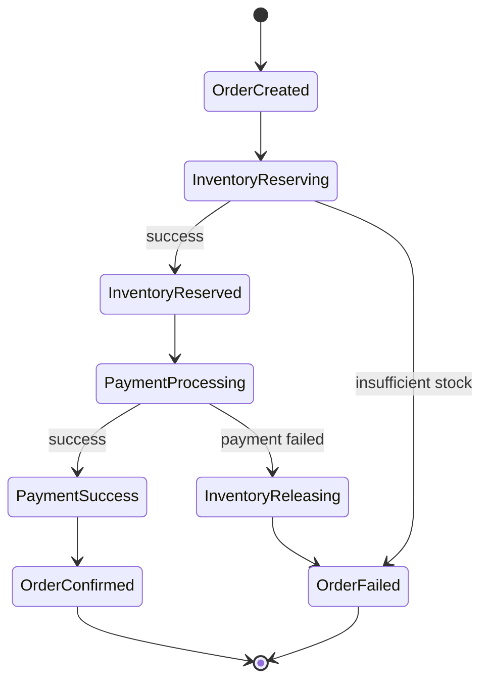

# AtlasPay - Distributed Order & Payment Platform

[](https://go.dev/)
[](https://docker.com/)
[](https://kubernetes.io/)

A production-grade distributed payment platform built with Go, demonstrating microservices architecture, event-driven patterns, and cloud-native deployment.

## 🏗️ Architecture

```
┌─────────────────────────────────────────────────────────────────────────┐
│                              API Gateway                                 │
│                    (Auth, Rate Limiting, Routing)                       │
└─────────────────────────────────────────────────────────────────────────┘
                                    │
          ┌─────────────────────────┼─────────────────────────┐
          ▼                         ▼                         ▼
┌─────────────────┐     ┌─────────────────┐     ┌─────────────────┐
│  Order Service  │     │ Payment Service │     │Inventory Service│
│                 │     │                 │     │                 │
│ - Order CRUD    │     │ - Process Pay   │     │ - Stock Mgmt    │
│ - State Machine │     │ - Idempotency   │     │ - Reservations  │
│ - Redis Cache   │     │ - Refunds       │     │ - Opt. Locking  │
└────────┬────────┘     └────────┬────────┘     └────────┬────────┘
         │                       │                       │
         └───────────────────────┼───────────────────────┘
                                 │
                    ┌────────────▼────────────┐
                    │     Apache Kafka        │
                    │   (Event Streaming)     │
                    └────────────┬────────────┘
                                 │
              ┌──────────────────┼──────────────────┐
              ▼                  ▼                  ▼
      ┌──────────────┐  ┌──────────────┐  ┌──────────────┐
      │  PostgreSQL  │  │    Redis     │  │   Jaeger     │
      │  (Primary)   │  │   (Cache)    │  │  (Tracing)   │
      └──────────────┘  └──────────────┘  └──────────────┘
```

## ✨ Key Features

| Feature | Implementation | Interview Points |
|---------|---------------|------------------|
| **Saga Pattern** | Orchestrated distributed transactions | Compensating transactions, failure recovery |
| **Event-Driven** | Kafka with exactly-once semantics | Dead letter queues, idempotent consumers |
| **Caching** | Redis cache-aside pattern | 35% latency reduction |
| **Auth** | JWT with refresh token rotation | RBAC, secure session management |
| **Observability** | Prometheus + Grafana + Jaeger | p95 latency, error rates, distributed tracing |
| **Rate Limiting** | Token bucket algorithm | Per-IP/user limiting |
| **Chaos Testing** | Failure injection scripts | Kafka down, DB slow, Redis failure |
| **Load Testing** | k6 with 500 VU stress test | 10k+ RPM benchmark |

## 🚀 Quick Start

### Prerequisites
- Go 1.21+
- Docker & Docker Compose
- (Optional) kubectl for Kubernetes deployment

### Local Development

```bash
# 1. Clone and navigate
cd AtlasPay

# 2. Start infrastructure
docker-compose up -d postgres redis kafka

# 3. Install dependencies
go mod download

# 4. Run the API Gateway
go run cmd/api-gateway/main.go
```

### Full Stack with Monitoring

```bash
# Start everything including Prometheus, Grafana, Jaeger
docker-compose up -d

# Access:
# - API: http://localhost:8080
# - Grafana: http://localhost:3000 (admin/admin123)
# - Jaeger: http://localhost:16686
# - Kafka UI: http://localhost:8090
```

## 📊 API Endpoints

### Auth
| Method | Endpoint | Description |
|--------|----------|-------------|
| POST | `/api/auth/register` | Register new user |
| POST | `/api/auth/login` | Login (returns access + refresh tokens) |
| POST | `/api/auth/refresh` | Rotate tokens |
| POST | `/api/auth/logout` | Revoke refresh token |

### Orders (Protected)
| Method | Endpoint | Description |
|--------|----------|-------------|
| POST | `/api/orders` | Create order |
| GET | `/api/orders` | List user's orders |
| GET | `/api/orders/{id}` | Get order details |
| PATCH | `/api/orders/{id}/cancel` | Cancel order |

### Payments (Protected)
| Method | Endpoint | Description |
|--------|----------|-------------|
| POST | `/api/payments` | Process payment (with idempotency key) |
| GET | `/api/payments/{id}` | Get payment details |
| POST | `/api/payments/{id}/refund` | Refund payment (admin only) |

### Inventory
| Method | Endpoint | Description |
|--------|----------|-------------|
| GET | `/api/inventory/{sku}` | Check stock |
| POST | `/api/inventory/reserve` | Reserve stock |
| POST | `/api/inventory/release` | Release reservation |

## 🔄 Saga: Order Placement Flow



**Compensating Transactions:**
- Payment fails → Inventory automatically released
- Any step fails → Previous steps compensated in reverse order

## 📈 Performance Results

| Metric | Result |
|--------|--------|
| Requests/min | 10,000+ |
| P95 Latency | <150ms |
| P99 Latency | <250ms |
| Cache Hit Rate | 85%+ |
| Error Rate | <0.1% |

## 🧪 Testing

### Unit Tests
```bash
go test ./... -v -cover
```

### Load Tests (k6)
```bash
# Install k6 first
k6 run scripts/k6/load-test.js
```

### Chaos Tests
```bash
./chaos/run-tests.sh
```

## ☸️ Kubernetes Deployment

```bash
# Apply infrastructure
kubectl apply -f deployments/kubernetes/infrastructure.yaml

# Deploy API Gateway
kubectl apply -f deployments/kubernetes/api-gateway.yaml

# Check HPA status
kubectl get hpa
```

## 🏛️ Project Structure

```
AtlasPay/
├── cmd/                    # Service entrypoints
│   └── api-gateway/
├── internal/
│   ├── common/             # Shared code
│   │   ├── auth/           # JWT + RBAC
│   │   ├── cache/          # Redis wrapper
│   │   ├── config/         # Configuration
│   │   ├── database/       # PostgreSQL
│   │   ├── kafka/          # Producer/Consumer
│   │   ├── logger/         # Structured logging
│   │   ├── metrics/        # Prometheus
│   │   ├── middleware/     # HTTP middleware
│   │   └── saga/           # Saga orchestrator
│   ├── auth/               # Auth domain
│   ├── order/              # Order domain
│   ├── payment/            # Payment domain
│   └── inventory/          # Inventory domain
├── pkg/events/             # Shared event schemas
├── deployments/            # Docker, K8s configs
├── chaos/                  # Chaos testing
├── scripts/                # DB migrations, k6 tests
└── grafana/                # Dashboard configs
```

## 💡 Interview Talking Points

1. **"Walk me through a distributed transaction"**
   → Explain saga with order→inventory→payment flow and compensations

2. **"How do you handle failures?"**
   → Dead letter queues, circuit breakers, chaos testing results

3. **"What about observability?"**
   → Show Grafana dashboards: p95 latency, error rate, saga metrics

4. **"Can it scale?"**
   → k6 results, HPA configuration, Redis caching strategy

5. **"Cost considerations?"**
   → Cache hit rates, autoscaling policies, connection pooling

## 📄 License

MIT

---

**Built with ❤️ for senior engineering interviews**
