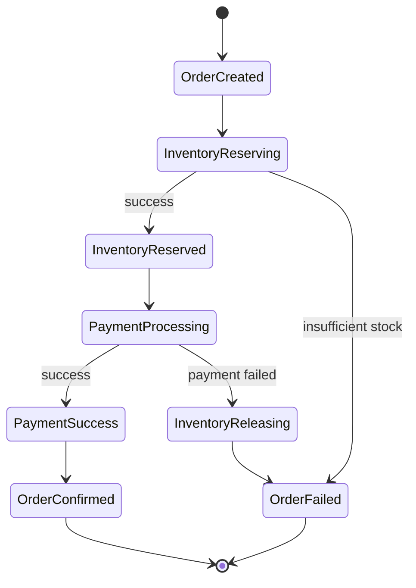

# AtlasPay - Distributed Order & Payment Platform

[](https://go.dev/)
[](https://docker.com/)
[](https://kubernetes.io/)
[](http://52.23.219.80:8080/health)

A distributed order and payment platform built with Go, demonstrating saga orchestration, payment idempotency, cache-aside reads, observability, and cloud-native deployment patterns.

## 🌐 Live Deployment

**[View Live Demo](http://52.23.219.80:8080/health)** - AWS EC2 Free Tier

- **API Endpoint:** http://52.23.219.80:8080
- **Health Check:** http://52.23.219.80:8080/health
- **Status:** ✅ Running (PostgreSQL + Redis + API)

## 📺 Live Demo (5 Minutes)

Want to see the system in action? Run the demo:

**For Interviews/Presentations:**
- 📋 **Full Guide:** [DEMO_GUIDE.md](docs/runbooks/DEMO_GUIDE.md) - Complete walkthrough with manual curl commands
- 🔧 **Automated:** `scripts/demo/demo-api.sh http://52.23.219.80:8080` (bash/WSL)

The demo shows:
- ✅ User authentication (JWT tokens)
- ✅ Order placement → Saga orchestration
- ✅ Distributed transaction coordination (Order → Inventory → Payment)
- ✅ Payment processing & idempotency
- ✅ Real-time saga monitoring

**Interview Points Covered:**
- Saga pattern for distributed transactions
- Idempotency for safe retries
- Cache-aside pattern
- Graceful degradation (Kafka optional)
- Distributed tracing & correlation IDs

## 🏗️ Architecture

```
┌─────────────────────────────────────────────────────────────────────────┐
│                              API Gateway                                 │
│                    (Auth, Rate Limiting, Routing)                       │
└─────────────────────────────────────────────────────────────────────────┘
                                    │
          ┌─────────────────────────┼─────────────────────────┐
          ▼                         ▼                         ▼
┌─────────────────┐     ┌─────────────────┐     ┌─────────────────┐
│  Order Service  │     │ Payment Service │     │Inventory Service│
│                 │     │                 │     │                 │
│ - Order CRUD    │     │ - Process Pay   │     │ - Stock Mgmt    │
│ - State Machine │     │ - Idempotency   │     │ - Reservations  │
│ - Redis Cache   │     │ - Refunds       │     │ - Opt. Locking  │
└────────┬────────┘     └────────┬────────┘     └────────┬────────┘
         │                       │                       │
         └───────────────────────┼───────────────────────┘
                                 │
                    ┌────────────▼────────────┐
                    │     Apache Kafka        │
                    │   (Event Streaming)     │
                    └────────────┬────────────┘
                                 │
              ┌──────────────────┼──────────────────┐
              ▼                  ▼                  ▼
      ┌──────────────┐  ┌──────────────┐  ┌──────────────┐
      │  PostgreSQL  │  │    Redis     │  │   Jaeger     │
      │  (Primary)   │  │   (Cache)    │  │  (Tracing)   │
      └──────────────┘  └──────────────┘  └──────────────┘
```

## ✨ Key Features

| Feature | Implementation | Technical Notes |
|---------|---------------|------------------|
| **Saga Pattern** | Orchestrated distributed transactions | Compensating transactions, failure recovery |
| **Event-Driven Order Flow** | Kafka-backed `order.created` processing | Async saga trigger with bounded retries and DLQ persistence |
| **Caching** | Redis cache-aside pattern | Faster repeated reads with PostgreSQL as source of truth |
| **Auth** | JWT with refresh token rotation | RBAC, secure session management |
| **Observability** | Prometheus + Grafana + Jaeger infrastructure | Request metrics, error rates, dashboard-ready telemetry |
| **Rate Limiting** | Token bucket algorithm | Per-IP/user limiting |
| **Chaos Testing** | Failure injection scripts | Kafka down, DB slow, Redis failure |
| **Load Testing** | k6 staged-load script | Throughput and latency validation workflow |
| **Visual Dashboard** | Premium Vanilla JS & CSS | Demo-ready UI, real-time tracking |

## 🚀 Quick Start

### Prerequisites
- Go 1.25+
- Docker & Docker Compose
- (Optional) kubectl for Kubernetes deployment

### Local Development

```bash
# 1. Clone and navigate
cd AtlasPay

# 2. Start infrastructure
docker-compose up -d postgres redis kafka

# 3. Install dependencies
go mod download

# 4. Run the API Gateway
go run cmd/api-gateway/main.go
```

### Full Stack with Monitoring

```bash
# Start everything including Prometheus, Grafana, Jaeger
docker-compose up -d

# Access:
# - API: http://localhost:8080
# - Grafana: http://localhost:3000 (admin/admin123)
# - Jaeger: http://localhost:16686
# - Kafka UI: http://localhost:8090

# 5. Checkout Failure Lab
# Open web/index.html in your browser
```

### Static Frontend Modes

`web/index.html` is a dependency-free static frontend suitable for Vercel or any
static host. It selects one of two clearly labeled modes:

- **Live Backend Mode:** Uses the AtlasPay API after a short `/health` check.
- **Demo Simulation Mode:** Runs deterministic checkout, payment-failure, and
  inventory-compensation behavior entirely in the browser.

To use a separately hosted API, define the public, non-secret API URL before the
application script runs:

```html
<script>
  window.ATLASPAY_API_BASE_URL = "https://api.example.com";
</script>
```

When the page runs on `localhost` or `127.0.0.1` without that setting, it checks
`http://localhost:8080`. Public hosts never try a visitor's localhost. If the API
URL is missing, unhealthy, or a live API request fails, the UI switches to Demo
Simulation Mode.

Demo Simulation Mode visualizes the saga steps and browser-side state changes;
it does not run or claim to validate Kafka, PostgreSQL, Redis, persistence,
distributed retries, or real payment processing. Validate the full
infrastructure path locally with `docker compose up -d` and the API at
`http://localhost:8080`.

### Proof / Reproducibility

See [docs/evidence/README.md](docs/evidence/README.md) for the commands run,
captured outputs, and current validation gaps. The public frontend falls back to
browser simulation when the API is unavailable; Kafka, PostgreSQL, and Redis are
not running in that Vercel/static-host simulation. Local evidence includes
passing Dockerized Go tests and a Docker Compose smoke run covering successful
checkout, payment-failure compensation, payment idempotency, metrics, and Kafka
publish/consume log markers. A separate bounded DLQ smoke verifies three failed
consumer attempts, PostgreSQL dead-letter persistence, publication to
`atlaspay.dlq`, and continued consumption. The local proof script explicitly
provisions its two required Kafka topics.

GitHub Actions is configured to run Dockerized Go tests, Compose validation,
whitespace checks, and both Docker Compose smoke workflows with a 60-second
health deadline, failure-log upload, and unconditional volume cleanup.
Configuration alone is not a passing-CI claim; use the repository's Actions
page for the current run status.

```powershell
# Go tests without requiring a local Go installation
docker run --rm -v "${PWD}:/src" -w /src golang:1.25 go test ./...

# Local backend health and Kafka-backed checkout smoke
docker compose config --quiet
docker compose up -d --build --wait postgres redis zookeeper kafka api-gateway
docker compose ps
Invoke-RestMethod http://localhost:8080/health
.\scripts\dlq-smoke.ps1
.\scripts\demo-smoke.ps1
docker compose logs api-gateway | Select-String "event published|event processed"
docker compose down -v
```

## 🎥 Demo & Learning Resources
- **[Premium Dashboard](web/index.html)**: Visualize Saga states and system health.
- **[User Story Scenarios](docs/USER_STORIES.md)**: Real-world business cases (Happy path vs Payment failure).
- **[Cloud Deployment Notes](docs/deployment/CLOUD_DEPLOYMENT.md)**: EC2 setup and Docker Hub push instructions.
- **[Local Deployment Notes](docs/deployment/LOCAL_DEPLOYMENT.md)**: Free/local options for validating and recording the system.
- **[Architecture Deep Dive](docs/architecture/ARCHITECTURE_DEEP_DIVE.md)**: System design and domain breakdown.

## 📊 API Endpoints

### Auth
| Method | Endpoint | Description |
|--------|----------|-------------|
| POST | `/api/auth/register` | Register new user |
| POST | `/api/auth/login` | Login (returns access + refresh tokens) |
| POST | `/api/auth/refresh` | Rotate tokens |
| POST | `/api/auth/logout` | Revoke refresh token |

### Orders (Protected)
| Method | Endpoint | Description |
|--------|----------|-------------|
| POST | `/api/orders` | Create order |
| GET | `/api/orders` | List user's orders |
| GET | `/api/orders/{id}` | Get order details |
| PATCH | `/api/orders/{id}/cancel` | Cancel order |

### Payments (Protected)
| Method | Endpoint | Description |
|--------|----------|-------------|
| POST | `/api/payments` | Process payment (with idempotency key) |
| GET | `/api/payments/{id}` | Get payment details |
| POST | `/api/payments/{id}/refund` | Refund payment (admin only) |

### Inventory
| Method | Endpoint | Description |
|--------|----------|-------------|
| GET | `/api/inventory/{sku}` | Check stock |
| POST | `/api/inventory/reserve` | Reserve stock |
| POST | `/api/inventory/release` | Release reservation |

## 🔄 Saga: Order Placement Flow


```mermaid
stateDiagram-v2
    [*] --> OrderCreated
    OrderCreated --> InventoryReserving
    InventoryReserving --> InventoryReserved: success
    InventoryReserving --> OrderFailed: insufficient stock
    InventoryReserved --> PaymentProcessing
    PaymentProcessing --> PaymentSuccess: success
    PaymentProcessing --> InventoryReleasing: payment failed
    InventoryReleasing --> OrderFailed
    PaymentSuccess --> OrderConfirmed
    OrderConfirmed --> [*]
    OrderFailed --> [*]
```

**Compensating Transactions:**
- Payment fails → Inventory automatically released
- Any step fails → Previous steps compensated in reverse order

## 📈 Performance Targets

| Metric | Result |
|--------|--------|
| Requests/min | Validated through k6 load-test runs |
| P95 Latency | Tracked through Prometheus histograms and k6 thresholds |
| P99 Latency | Tracked during load-test runs |
| Cache Hit Rate | Exposed through cache metrics |
| Error Rate | Tracked through HTTP and load-test metrics |

## 🧪 Testing

### Unit Tests
```bash
go test ./... -v -cover
```

### Load Tests (k6)
```bash
# Install k6 first
k6 run scripts/k6/load-test.js
```

### Chaos Tests
```bash
./chaos/run-tests.sh
```

## ☸️ Kubernetes Deployment

```bash
# Apply infrastructure
kubectl apply -f deployments/kubernetes/infrastructure.yaml

# Deploy API Gateway
kubectl apply -f deployments/kubernetes/api-gateway.yaml

# Check HPA status
kubectl get hpa
```

## 🏛️ Project Structure

```
AtlasPay/
├── cmd/                    # Service entrypoints
│   └── api-gateway/
├── internal/
│   ├── common/             # Shared code
│   │   ├── auth/           # JWT + RBAC
│   │   ├── cache/          # Redis wrapper
│   │   ├── config/         # Configuration
│   │   ├── database/       # PostgreSQL
│   │   ├── kafka/          # Producer/Consumer
│   │   ├── logger/         # Structured logging
│   │   ├── metrics/        # Prometheus
│   │   ├── middleware/     # HTTP middleware
│   │   └── saga/           # Saga orchestrator
│   ├── auth/               # Auth domain
│   ├── order/              # Order domain
│   ├── payment/            # Payment domain
│   └── inventory/          # Inventory domain
├── pkg/events/             # Shared event schemas
├── deployments/            # Docker, K8s configs
├── chaos/                  # Chaos testing
├── scripts/                # DB migrations, k6 tests
└── grafana/                # Dashboard configs
```

## 💡 Key Technical Talking Points

1. **Saga flow**
   → Explain saga with order→inventory→payment flow and compensations

2. **Failure handling**
   → Explain compensation, idempotency, retry boundaries, and chaos-test scenarios

3. **Observability**
   → Show Grafana dashboards: p95 latency, error rate, saga metrics

4. **Scaling path**
   → k6 results, HPA configuration, Redis caching strategy

5. **Operational tradeoffs**
   → Cache hit rates, autoscaling policies, connection pooling

## 📄 License

MIT

---

**Built with ❤️ for FUTURE.**
