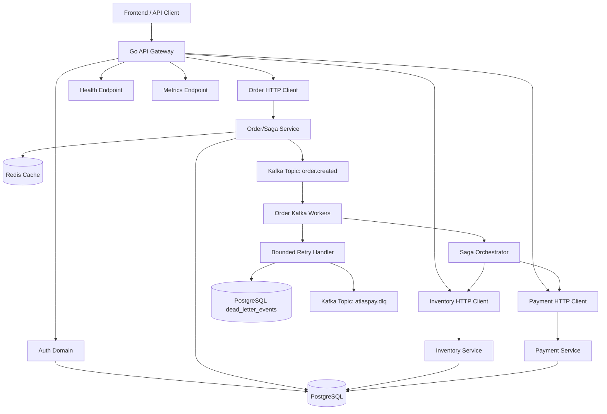
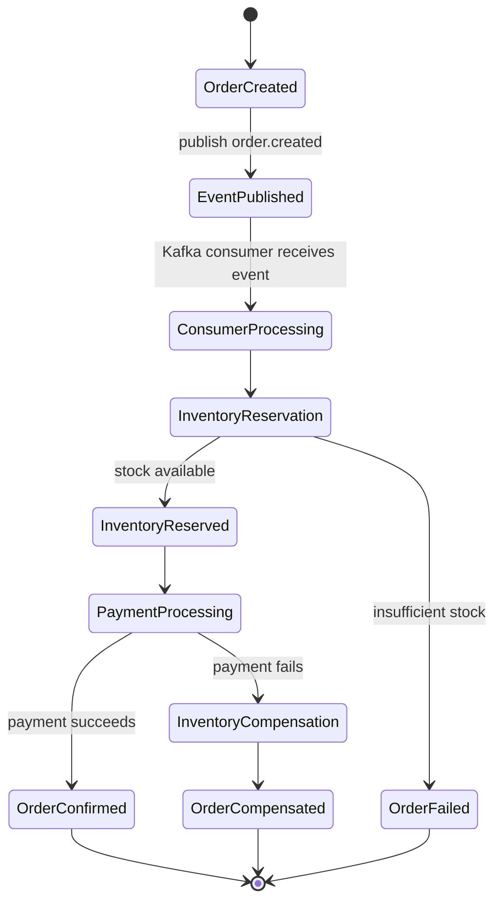

# AtlasPay — Distributed Payment Platform

[](https://go.dev/)
[](https://kafka.apache.org/)
[](https://www.postgresql.org/)
[](https://redis.io/)
[](https://docs.docker.com/compose/)
[](https://github.com/Falcon-J/AtlasPay/actions/workflows/ci.yml)

AtlasPay is a Kafka-backed distributed checkout and payment platform built with Go, Kafka, PostgreSQL, Redis, and Docker.

See [`docs/LEARNING_PATH.md`](docs/LEARNING_PATH.md) for the staged path from
the current gateway-plus-payment-and-inventory topology to independently
deployed services.

It demonstrates backend reliability patterns used in payment and commerce systems: event-driven checkout processing, saga-style coordination, payment idempotency, bounded retries, dead-letter routing, inventory compensation, health checks, metrics, and reproducible Docker-based validation.

---

## Highlights

* Kafka-backed checkout flow using `order.created` events
* Gateway/Auth process with private clients for Order/Saga, Payment, and Inventory
* Independently deployed Order/Saga, Payment, and Inventory services with private HTTP contracts
* PostgreSQL persistence for transactional state
* Redis cache-aside reads
* Payment idempotency for safe duplicate/retry handling
* Saga-style inventory compensation on payment failure
* Bounded Kafka consumer retries with backoff
* PostgreSQL dead-letter persistence
* Kafka DLQ publishing to `atlaspay.dlq`
* Docker Compose smoke workflows for success and failure paths
* GitHub Actions workflow for automated validation
* Static frontend demo with live backend mode and browser simulation fallback

Compose currently runs four application processes: the API gateway, Order/Saga,
Payment, and Inventory services. The gateway owns public JWT authentication;
Order/Saga owns Kafka workers, outbox publication, and saga state. See
[`docs/CURRENT_STATE.md`](docs/CURRENT_STATE.md) and the [integration
matrix](docs/INTEGRATION_MATRIX.md) for the verified boundary.

---

## Architecture


```mermaid
flowchart TD
    A[Frontend / API Client] --> B[Go API Gateway]

    B --> C[Auth Domain]
    B --> D[Order HTTP Client]
    B --> E[Inventory HTTP Client]
    B --> F[Payment HTTP Client]
    F --> P[Payment Service]
    E --> I[Inventory Service]
    D --> O[Order/Saga Service]

    C --> DB[(PostgreSQL)]
    O --> DB
    I --> DB
    P --> DB

    O --> R[(Redis Cache)]

    O --> K[Kafka Topic: order.created]
    K --> W[Order Kafka Workers]
    W --> S[Saga Orchestrator]

    S --> E
    S --> F

    W --> Retry[Bounded Retry Handler]
    Retry --> DLQDB[(PostgreSQL dead_letter_events)]
    Retry --> DLQK[Kafka Topic: atlaspay.dlq]

    B --> H[Health Endpoint]
    B --> M[Metrics Endpoint]
```

---

## Core Service Domains

| Domain    | Responsibility                                      |
| --------- | --------------------------------------------------- |
| Auth      | User registration, login, JWT-protected access      |
| Orders    | Order creation, order state, Kafka event publishing |
| Inventory | Stock checks, reservation, release, compensation    |
| Payments  | Payment processing, idempotency, failure handling   |

---

## Checkout Flow


```mermaid
stateDiagram-v2
    [*] --> OrderCreated
    OrderCreated --> EventPublished: publish order.created
    EventPublished --> ConsumerProcessing: Kafka consumer receives event
    ConsumerProcessing --> InventoryReservation
    InventoryReservation --> InventoryReserved: stock available
    InventoryReservation --> OrderFailed: insufficient stock
    InventoryReserved --> PaymentProcessing
    PaymentProcessing --> OrderConfirmed: payment succeeds
    PaymentProcessing --> InventoryCompensation: payment fails
    InventoryCompensation --> OrderCompensated
    OrderConfirmed --> [*]
    OrderFailed --> [*]
    OrderCompensated --> [*]
```

---

## Reliability Behaviors

| Behavior                 | Implementation                                            |
| ------------------------ | --------------------------------------------------------- |
| Event-driven checkout    | Order creation publishes `order.created` to Kafka         |
| Saga processing          | Kafka consumer executes inventory and payment workflow    |
| Payment failure handling | Reserved inventory is released through compensation       |
| Idempotent payments      | Reused idempotency keys return the same payment result    |
| Bounded retries          | Failed consumer handling retries up to a configured limit |
| Dead-letter persistence  | Exhausted events are stored in PostgreSQL                 |
| Kafka DLQ routing        | Dead-lettered events are published to `atlaspay.dlq`      |
| Consumer continuation    | Follow-up events validate the consumer keeps processing   |
| Observability            | Health and metrics endpoints support validation           |

---

## Validation Coverage

AtlasPay includes Docker-based workflows covering success and failure scenarios.

| Case | Covered behavior                           |
| ---- | ------------------------------------------ |
| 1    | Backend health check                       |
| 2    | PostgreSQL connectivity                    |
| 3    | Redis/cache connectivity                   |
| 4    | User registration and login                |
| 5    | Successful order creation                  |
| 6    | Kafka `order.created` publish              |
| 7    | Kafka consumer processing                  |
| 8    | Inventory reservation                      |
| 9    | Payment success and order confirmation     |
| 10   | Payment failure and inventory compensation |
| 11   | Idempotent payment reuse                   |
| 12   | Invalid event retry exhaustion             |
| 13   | PostgreSQL dead-letter persistence         |
| 14   | Kafka DLQ publication                      |
| 15   | Consumer continuation after DLQ event      |
| 16   | Metrics endpoint reachability              |

Evidence files are stored under:

```text
docs/evidence/
```

Key evidence files:

```text
docs/evidence/README.md
docs/evidence/go-test-output.txt
docs/evidence/docker-compose-health.txt
docs/evidence/demo-smoke-output.txt
docs/evidence/dlq-smoke-output.txt
docs/evidence/kafka-smoke-log.txt
```

---

## Tech Stack

| Layer         | Technology                                   |
| ------------- | -------------------------------------------- |
| Backend       | Go 1.25                                      |
| Messaging     | Kafka                                        |
| Database      | PostgreSQL                                   |
| Cache         | Redis                                        |
| Validation    | Docker Compose, Go tests, smoke scripts      |
| Observability | Health checks, Prometheus-compatible metrics |
| Frontend Demo | Static HTML, CSS, JavaScript                 |
| CI            | GitHub Actions                               |

---

## Quick Start

### Prerequisites

* Docker Desktop
* Docker Compose
* PowerShell for smoke scripts
* Go 1.25 optional, because tests can run through Dockerized Go

---

## Run the Full Stack

```bash
docker compose up -d --build --wait postgres redis zookeeper kafka
```

Provision the application topics before starting the API consumer:

```powershell
foreach ($topic in @("atlaspay.orders", "atlaspay.dlq")) {
  $partitions = if ($topic -eq "atlaspay.orders") { 16 } else { 1 }
  docker compose exec -T kafka kafka-topics --bootstrap-server localhost:9092 --create --if-not-exists --topic $topic --partitions $partitions --replication-factor 1
}
docker compose up -d --build --wait payment-service inventory-service order-service api-gateway
```

Check backend health:

```bash
curl http://localhost:8080/health/live
curl http://localhost:8080/health/ready
```

The first endpoint is process-only liveness. The second checks gateway
dependencies and returns `503` when the gateway is not ready. The compatibility
`/health` endpoint retains the detailed database/cache status shape:

```json
{
  "status": "healthy",
  "db": "up",
  "cache": "up"
}
```

Stop and clean local volumes:

```bash
docker compose down -v
```

---

## Run Tests

Without installing Go locally:

### Bash

```bash
docker run --rm -v "$PWD:/src" -w /src golang:1.25 go test ./...
```

### PowerShell

```powershell
docker run --rm -v "${PWD}:/src" -w /src golang:1.25 go test ./...
```

---

## Run Smoke Workflows

Start the infrastructure, provision Kafka topics, then start the API as shown
in [Run the Full Stack](#run-the-full-stack).

Run checkout smoke:

```powershell
powershell -ExecutionPolicy Bypass -File scripts/demo-smoke.ps1
```

Run the Payment service contract smoke:

```powershell
powershell -ExecutionPolicy Bypass -File scripts/payment-service-contract-smoke.ps1
```

Run the Inventory and Order/Saga contract smokes:

```powershell
powershell -ExecutionPolicy Bypass -File scripts/inventory-service-contract-smoke.ps1
powershell -ExecutionPolicy Bypass -File scripts/order-service-contract-smoke.ps1
```

Run DLQ smoke:

```powershell
powershell -ExecutionPolicy Bypass -File scripts/dlq-smoke.ps1
```

Run duplicate-event safety smoke:

```powershell
powershell -ExecutionPolicy Bypass -File scripts/duplicate-event-smoke.ps1
```

Run outbox recovery smoke:

```powershell
powershell -ExecutionPolicy Bypass -File scripts/outbox-recovery-smoke.ps1
```

Run saga restart smoke:

```powershell
powershell -ExecutionPolicy Bypass -File scripts/saga-restart-smoke.ps1
```

Run the authoritative submit-and-completion benchmark:

```powershell
powershell -ExecutionPolicy Bypass -File scripts/completion-drain-load.ps1 `
  -TargetRPM 1000 -Duration 10s -SkuCount 32 -DrainTimeoutSeconds 60
```

This separates HTTP acceptance from authoritative PostgreSQL completion. The
raw local result is recorded under `docs/evidence/`; it is not production SLO
evidence.

Check Kafka event logs:

```powershell
docker compose logs order-service | Select-String "event published|event processed"
```

Clean up:

```powershell
docker compose down -v
```

---

## GitHub Actions

The CI workflow validates:

* Dockerized `go test ./...`
* Docker Compose configuration
* committed whitespace checks
* bounded Docker Compose startup
* checkout smoke workflow
* DLQ smoke workflow
* Kafka publish/process assertions
* failure-log upload
* unconditional Docker cleanup

Workflow file:

```text
.github/workflows/ci.yml
```

---

## Static Frontend Demo

`web/index.html` is a dependency-free frontend that can run locally or on a static host.

It supports two modes:

### Live Backend Mode

Uses the AtlasPay API after a short `/health` check.

### Demo Simulation Mode

Runs deterministic checkout simulation entirely in the browser when the backend is unavailable.

Demo Simulation Mode visualizes:

* checkout creation
* inventory reservation
* payment failure
* inventory compensation
* revenue correctness
* saga-style logs

To configure a hosted backend API:

```html
<script>
  window.ATLASPAY_API_BASE_URL = "https://api.example.com";
</script>
```

---

## API Endpoints

### Auth

| Method | Endpoint             | Description   |
| ------ | -------------------- | ------------- |
| POST   | `/api/auth/register` | Register user |
| POST   | `/api/auth/login`    | Login         |
| POST   | `/api/auth/refresh`  | Refresh token |
| POST   | `/api/auth/logout`   | Logout        |

### Orders

| Method | Endpoint                  | Description  |
| ------ | ------------------------- | ------------ |
| POST   | `/api/orders`             | Create order |
| GET    | `/api/orders`             | List orders  |
| GET    | `/api/orders/{id}`        | Get order    |
| PATCH  | `/api/orders/{id}/cancel` | Cancel order |

### Payments

| Method | Endpoint                    | Description                          |
| ------ | --------------------------- | ------------------------------------ |
| POST   | `/api/payments`             | Process payment with idempotency key |
| GET    | `/api/payments/{id}`        | Get payment                          |
| POST   | `/api/payments/{id}/refund` | Refund payment, admin only           |

### Inventory

| Method | Endpoint                 | Description       |
| ------ | ------------------------ | ----------------- |
| GET    | `/api/inventory/{sku}`   | Check stock       |
| POST   | `/api/inventory/reserve` | Reserve inventory |
| POST   | `/api/inventory/release` | Release inventory |

### System

| Method | Endpoint   | Description                     |
| ------ | ---------- | ------------------------------- |
| GET    | `/health/live`  | Process liveness                 |
| GET    | `/health/ready` | Database/cache readiness         |
| GET    | `/health`      | Legacy detailed health status    |
| GET    | `/metrics` | Prometheus-compatible metrics   |

---

## Local Load Testing

AtlasPay includes k6 scripts for local load testing.

```powershell
powershell -ExecutionPolicy Bypass -File scripts/completion-drain-load.ps1 `
  -TargetRPM 1000 -Duration 10s -SkuCount 32 -DrainTimeoutSeconds 60
```

This benchmark separates HTTP acceptance from authoritative PostgreSQL
completion. `scripts/k6/checkout-load.js` is retained as a diagnostic example
of per-order polling; do not use its HTTP p95 as completed-checkout evidence.

Recommended performance evidence format:

```text
Date:
Machine:
Command:
Duration:
Request rate:
p95 latency:
p99 latency:
Failure rate:
Docker Compose services:
Commit SHA:
```

---

## Project Structure

The deployed application processes are `cmd/api-gateway`,
`cmd/order-service`, `cmd/payment-service`, and `cmd/inventory-service`.

```text
AtlasPay/
├── .github/
│   └── workflows/              # GitHub Actions CI
├── cmd/
│   └── api-gateway/            # API entrypoint
├── internal/
│   ├── auth/                   # Auth domain
│   ├── order/                  # Order domain
│   ├── inventory/              # Inventory domain
│   ├── payment/                # Payment domain + local/remote adapters
│   └── common/
│       ├── auth/               # JWT/RBAC helpers
│       ├── cache/              # Redis wrapper
│       ├── config/             # Runtime config
│       ├── database/           # PostgreSQL connection
│       ├── dlq/                # Dead-letter persistence
│       ├── kafka/              # Kafka producer/consumer
│       ├── logger/             # Structured logs
│       ├── metrics/            # Prometheus metrics
│       ├── middleware/         # HTTP middleware
│       └── saga/               # Saga orchestration
├── pkg/
│   └── events/                 # Shared event schemas
├── scripts/
│   ├── demo-smoke.ps1          # Checkout smoke workflow
│   ├── dlq-smoke.ps1           # DLQ smoke workflow
│   └── k6/                     # Load testing scripts
├── docs/
│   ├── evidence/               # Captured validation evidence
│   ├── architecture/           # Architecture notes
│   └── deployment/             # Deployment notes
├── web/
│   └── index.html              # Static checkout simulator
├── docker-compose.yml
├── Dockerfile
├── go.mod
└── README.md
```

---

#Key Tradeoffs 

* event-driven checkout systems
* saga-style compensation
* payment idempotency
* Kafka consumer retries
* dead-letter queues
* PostgreSQL vs Kafka DLQ responsibilities
* Docker Compose based integration validation
* health checks and metrics
* public frontend demo vs backend validation workflow

---

## License

MIT
